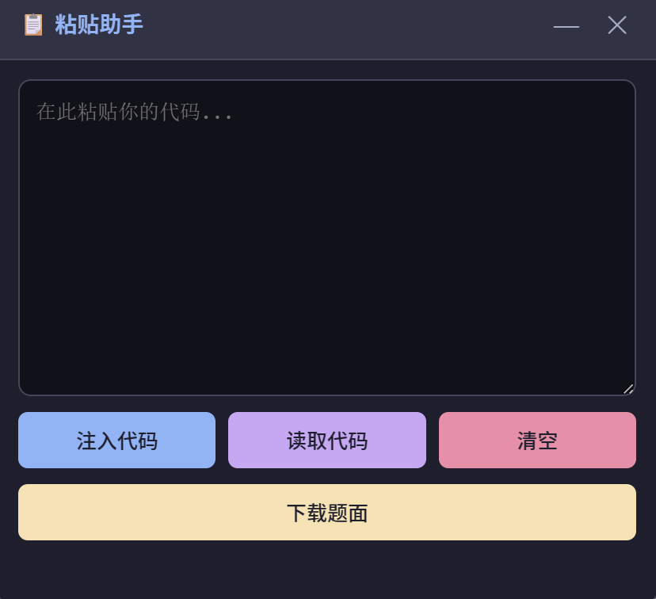

# 头歌粘贴助手 (EduCoder Paste Helper)

解除头歌(Educoder)网站代码编辑器的粘贴限制，支持代码注入、读取和题面下载。

## 效果预览



## 安装方法

1. 点击本仓库页面的绿色 **Code** 按钮，选择 **Download ZIP**
2. 将下载的 ZIP 文件解压到任意位置
3. 打开 Chrome 浏览器，地址栏输入 `chrome://extensions/` 回车
4. 右上角打开 **开发者模式**
5. 点击 **加载已解压的扩展程序**
6. 选择解压后的文件夹（包含 `manifest.json` 的那个目录）
7. 打开头歌网站，刷新页面即可使用

## 功能说明

安装后，头歌实训页面右上角会出现一个可拖动的浮窗面板：

- **注入代码** — 将面板中的代码写入编辑器
- **读取代码** — 从编辑器读取当前代码到面板
- **清空** — 清空面板文本框
- **下载题面** — 下载题面为 .md 文件（含图片和初始代码）

面板支持：
- 拖动标题栏移动位置
- 点击 `—` 最小化为圆形图标，再点击恢复
- 点击 `✕` 关闭面板

## AI 提示词

由于编辑器对多行代码的缩进适配存在问题，建议使用以下提示词让 AI 将代码压缩为单行后再粘贴注入：

```
请将你生成的 Python 代码压缩为一行。
使用分号 ; 连接多条语句，
使用 exec() 或 __import__ 等技巧处理 import，
用三元表达式替代 if-else，
用列表推导替代循环。
最终输出一行可直接运行的代码，不要换行。
```

## 注意事项

- 每次更新插件文件后，需要在 `chrome://extensions/` 点击插件的刷新按钮
- 首次使用「下载题面」时，浏览器可能提示是否允许下载多个文件，请选择允许
